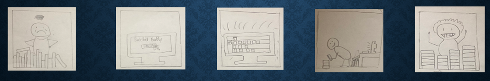
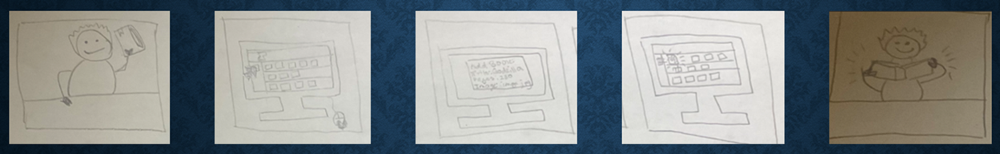
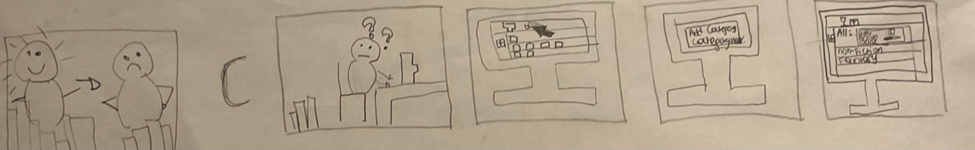

# Bookshelf-Buddy

## Project Team
- Patric Nurczyk
- McKenna Warrick
- Kate Payen

## Introduction
Our goal with Bookshelf Buddy is to create a simple and easy to use platform for managing and tracking reading progress. With features such as creating categories, tracking current pages in books, and setting personalized goals grants the user the confidence and organization to pursue reading as a hobby.

## User Research
Several Interviews were conducted that shed light on the diverse views and preferences each user has when it comes to tracking their book progress and activities in general. We found that users find reminders for goals demotivating, and enjoy tracking progress and being in control of organization. A common preference for tracking task progress were progress bars, drawing influence with popular tools such as the CanvasTools Chrome extension. In future development, we hope to implement and build upon our user feedback, and create motivating ways to continue to read.

## Storyboard

### Simple Task

#### Description
A user feeling overwhelmed by their book collection longs for a solution to organize it effectively. They discover Bookshelf Buddy, a website offering a platform to log in and efficiently arrange their books. By the end of their journey, the user finds joy in their newly organized book collection, tailored to their preferences.
The interface of Bookshelf Buddy simplifies organizing a book collection by letting users log in and efficiently arrange their books. With a user-friendly platform, users can easily add books to the system and customize their organization according to their preferences. This simplicity enables users to quickly and effectively manage their book collections, bringing joy and satisfaction to their reading experience.

### Moderate Task

#### Description
The user eagerly begins reading a captivating book, filled with excitement. However, their enjoyment is interrupted as they realize they need to leave for somewhere else. Reluctantly, they set the book aside but make a mental note to resume reading as soon as they can. Before leaving, they quickly open the Bookshelf Buddy app to add the book to their collection. They input details such as the title, number of pages, and the page they stopped on, ensuring they can easily pick up where they left off later.
The interface for the Bookshelf Buddy app provides users with more control over organization compared to a simple task. By allowing users to input details such as the book title, number of pages, and the page they stopped on, the app enables them to effectively manage their reading progress and easily pick up where they left off later

### Complex Task

#### Description
The user receives several new books for Christmas, including the Harry Potter series, which adds variety to their collection, particularly in terms of genres. Upon adding the books to Bookshelf Buddy, the user initially struggles to find a way to organize them effectively. However, they discover that the interface allows them to create categories and then drag and drop the books into these categories. This feature enables the user to get more specific with their organization, resulting in a clear and orderly display of their books. The user feels happy and excited as they can now easily navigate their organized collection.

## Figma Prototypes

#### Static Renderings
https://www.figma.com/file/nj7N580HJRvEwlYmxicJZ2/The-Bookshelf-(Community)?type=design&node-id=2010-838&mode=design&t=R6CqPfRcIcEwxnZZ-0

#### Interactive 
https://www.figma.com/proto/nj7N580HJRvEwlYmxicJZ2/The-Bookshelf-(Community)?type=design&node-id=2010-840&t=Dtk6q2YoslwhnudB-1&scaling=contain&page-id=2010%3A838&mode=design

